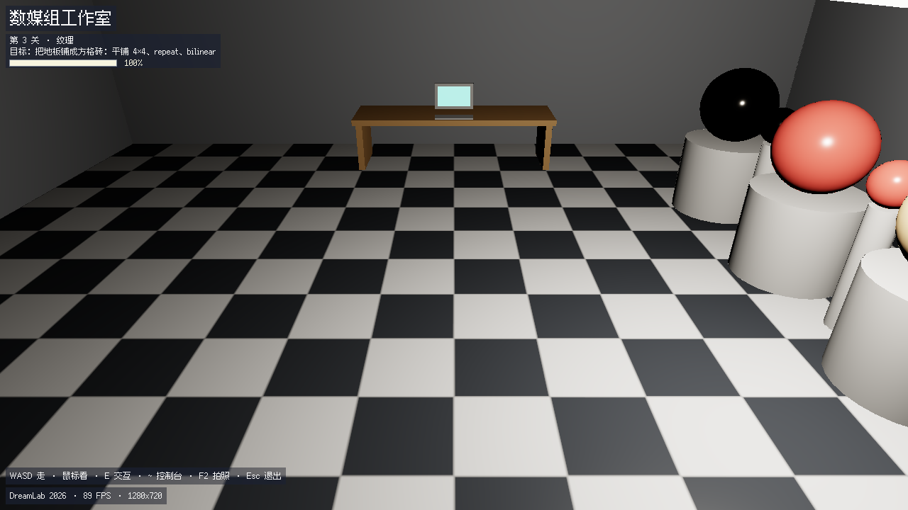

# dreamlab-rt · 数媒组工作室

一个**自己手写的实时 3D 引擎**，和一个**闯关式教学游戏**：你在全黑的工作室里醒来，
一步步把灯点亮、把材质调对、把地板铺好。

引擎里没有一个第三方库 —— 光栅化、PBR 光照、程序化纹理、中文像素字模、PNG 编码，
全是这个仓库里自己写的 C++。所以你改的每一行，都能一路追到屏幕上那个像素是怎么来的。



> 上图就是第 3 关通关时的画面，进度 100% —— 由程序自己 `--shot` 出来的，没有后期处理。

## 三条命令

```bash
git clone <仓库地址> && cd dreamlab-rt
./build.bat                        # Windows。Linux / macOS 用 ./build.sh
build\dreamlab.exe                 # 开玩（也可以双击 run.bat）
```

需要 **Visual Studio 2022**（社区版就够，装「使用 C++ 的桌面开发」）或 **MinGW g++**。
**没有别的依赖**：不用 GPU、不用引擎、不用包管理器、不用联网。

> **跑起来是一间全黑的屋子，这是对的。**
> 那是第 0 关本身 —— 这游戏就从"一片黑暗"开始。你身上有一点微光，
> 远处桌子上的终端屏幕亮着，跟着它走。

## 怎么玩

| 键 | 干什么 |
|---|---|
| `W` `A` `S` `D` | 走 |
| 鼠标 | 转视角 |
| `E` | 和面前的东西交互（终端、展板、灯） |
| `~` | 开 / 关控制台（游戏内的中文命令行） |
| `R` | **重新读 `content/` 里的数据 —— 世界当场变，不重启** |
| `F2` | 存一张截图到 `shots/` |
| `Esc` | 关控制台；控制台没开时 = 退出 |

窗口默认按你的核数自适应（4 核及以下 960×540、8 核 1280×720、16 核及以上 1600×900）。
想指定就 `--width` / `--height`，完整参数表见 `build\dreamlab.exe --help`。

## 这个游戏想教你什么

**核心循环**（整个项目的灵魂，四关都是这一件事）：

```
走动探索 → 察觉"太暗了 / 太丑了 / 不对" → 走到终端按 E
        → 游戏告诉你该改哪个文件 → 去编辑器里改 → 存盘
        → 回到游戏按 R（改数据）或重新编译（改 C++）
        → 世界立刻变化 → 过关 → 进下一关
```

**四个关卡 = 四堂课**，每关的题面就是数媒组的日常工作切片：

| 关 | 题面 | 你要改的地方 | 学到的东西 |
|---|---|---|---|
| 0 · 黑暗 | 让房间重新亮起来 | `game/shaders/lighting.cpp` 里的 `kAmbientStrength` | 光照模型、着色器到底是什么 |
| 1 · 第一束光 | 把主光装回吊灯里并点亮 | `content/lights.txt` + `content/materials.txt` | 点光源、平方反比衰减、为什么"位置比强度重要" |
| 2 · 材质 | 照着样板把三个球的材质改回来 | `content/materials.txt` | PBR 三件套：albedo / roughness / metallic |
| 3 · 纹理 | 把地板铺成方格砖 | `content/textures.txt` | UV 缩放、寻址模式、最近邻 vs 双线性 |

关卡进度由**一台固定机位的评委相机**自动判定 —— 和你站在哪、看哪无关，
所以"我明明做对了却不过关"不会发生。四关都能自动验证：`build\dreamlab.exe --all-levels --auto`。

## 你可以动的三个地方

| 面 | 在哪 | 怎么生效 | 适合 |
|---|---|---|---|
| **数据** | `content/*.txt` | 存盘 → 按 `R`，**不重启不编译** | 零基础 / 美术向 |
| **着色器** | `game/shaders/lighting.cpp` | 重新编译（几秒），存档把你放回原位 | 想学原理 |
| **关卡逻辑** | `game/levels/*.cpp` | 同上 | 有编程基础 |

**强烈建议先动数据。** 改一个数、按一下 `R`、画面当场就变 —— 这个反馈循环是整件事的乐趣所在。

## 目录

```
core/      平台与数学底座（没有"游戏"概念）：向量/矩阵/帧缓冲/光栅化/PNG 编码/
           字模/纹理采样 · platform_win32.cpp 是真窗口
engine/    世界层：实体/材质/网格/光照着色 · content 数据解析 · 热重载 · 控制台 · 存档
game/      内容与玩法：main.cpp（主循环与命令行）· player（走位/碰撞/射线）·
           workshop（工作室场景）· shaders/lighting.cpp（逐像素光照，**学生改的就是它**）·
           levels/（四个关卡）
content/   数据即题面：materials.txt · lights.txt · lighting.txt · textures.txt
assets/    自烘焙像素中文字模 pixel12.bin（17,573 个汉字，OFL-1.1 许可）
tools/     gen_font_atlas.py（烘焙字模）· png_diff.py（逐像素比对，需要 Pillow）
docs/      四篇文档，见下
```

## 其它构建方式

```bash
bash build.sh                      # Linux / macOS / Git Bash（Windows 上会转交 build.bat）
cmake -B build-cmake && cmake --build build-cmake --config Release
                                   # CMake 备路径，产物在 build-cmake/
```

CMake 那条路是给"build.bat 探测不到工具链"准备的。两个注意点：
构建目录**必须留在仓库内**（程序启动时会从 exe 往上找仓库根，往外跑 3 级就找不着了），
以及一定要带 `--config Release` —— 不带的话 VS 生成器会去构建没有优化的 Debug。

## 游戏内控制台

按 `~` 打开，命令全是 ASCII，不用切输入法：

```
help                  这份帮助
cls                   清屏
ambient <亮度|r g b>  环境光，例如 ambient 0.1 或 ambient 0.3 0.4 0.6
light                 列出每盏灯的位置和强度
light <强度>          主光，例如 light 60
light <灯号> <强度>   指定某一盏，例如 light 0 60
inspect [材质|物体]   看材质参数，例如 inspect plastic
look <物体>           看铭牌，例如 look lamp / look board
reload                重新读 content/（= 按 R）
level                 这一关要你干什么、现在做到哪了
level <关号>          跳到某一关，例如 level 0
shot                  存一张干净的 PNG（不含面板）到 shots/
```

## 性能

这是个**纯 CPU 的软光栅化器**，帧率取决于画面里有多少东西、以及你的机器。参考值
（开发机 32 核，关卡 3 评委机位这个"满屏地板"的重画面，含随身微光）：

| 尺寸 | 4 线程 | 8 线程 | 32 核 |
|---|---|---|---|
| 960×540 | 33 帧 | 56 帧 | 57 帧 |
| 1280×720 | 19 帧 | 37 帧 | 46 帧 |
| 1600×900 | ~15 帧 | 24 帧 | 41 帧 |

**数字很吃机器负载** —— 同一台机器上开着别的重负载程序（游戏、渲染、编译），
实测会掉到大约一半。想自己量，用这条命令（`work=` 是一帧真正干活的时间）：

```bash
build\dreamlab.exe --width 960 --height 540 --frames 90 --trace
```

掉帧的话按 `--fpscap 30` 锁帧省电，或换个小一点的窗口。

## 文档

| 文档 | 讲什么 |
|---|---|
| [01-环境搭建](docs/01-环境搭建.md) | 三条命令背后的每一步，跑不起来时查这里 |
| [02-报错急救表](docs/02-报错急救表.md) | **按症状查**：改崩了、满屏红块、进度不动…… 都有恢复步骤 |
| [03-20分钟看懂渲染管线](docs/03-20分钟看懂渲染管线.md) | 从顶点到像素，这个引擎每一步在干什么 |
| [04-数媒组方向地图](docs/04-数媒组方向地图.md) | 实时渲染 / 技术美术 / 数字孪生 …… 这些方向到底做什么 |

## 许可

代码随意使用。中文字模来自 OFL-1.1 许可的开源像素字体，见 `assets/font/LICENSE`。
