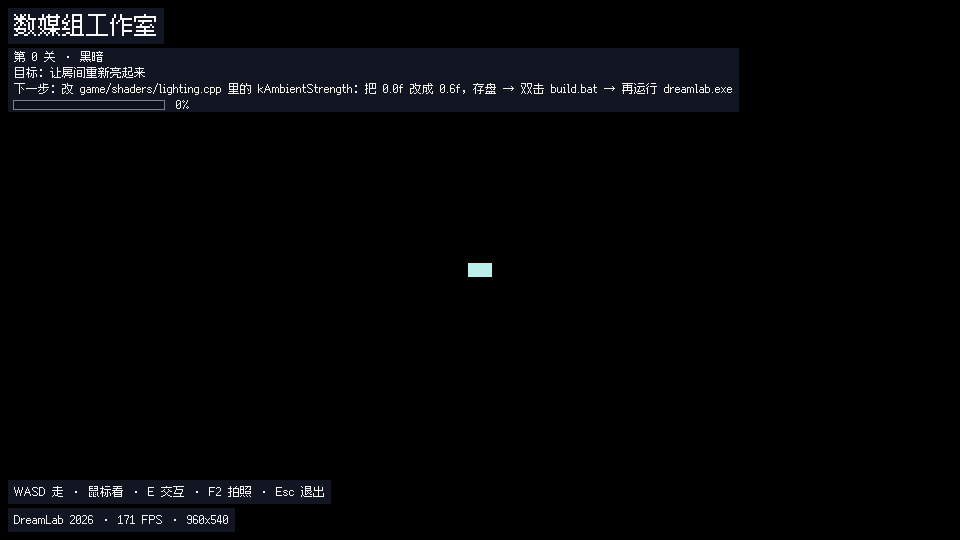

# 00 · 新手使用说明

**这份是给完全没接触过这些东西的人写的。** 不用会编程，不用用过命令行 ——
每一步都写清楚"敲什么"和"然后你会看到什么"。

全程大概 **半小时**，其中大部分时间是等安装程序下载安装。

> 如果你已经装过 Visual Studio、也会用命令行，这份对你太啰嗦了 ——
> 直接看 [README](../README.md) 的「三条命令」和 [01-环境搭建](01-环境搭建.md)。

---

## 目录

1. [先确认你的电脑行不行](#1-先确认你的电脑行不行)
2. [装 Git](#2-装-git)
3. [装 C++ 编译器](#3-装-c-编译器)
4. [把代码拿下来](#4-把代码拿下来)
5. [编译](#5-编译)
6. [开玩](#6-开玩)
7. [卡住了怎么办](#7-卡住了怎么办)

---

## 1. 先确认你的电脑行不行

| 需要 | 说明 |
|---|---|
| Windows 10 或 11 | 主路径就是 Windows。macOS / Linux 也能跑，见 [01](01-环境搭建.md) 的「三条构建路径」 |
| 能上网 | 下面两步都要下载安装包 |
| 几 GB 空闲磁盘 | 主要是 Visual Studio 占地方 |
| 能装软件（管理员权限） | 装 Git 和 Visual Studio 的时候会弹权限确认，点是 |

**不需要显卡。** 这个游戏是用 CPU 一个像素一个像素算出来的，不用显卡、不用显卡驱动、
不用装任何游戏引擎。机房的老机器、虚拟机、远程桌面里都能跑。

---

## 2. 装 Git

**Git 是什么**：一个把代码从网上下下来的工具。我们就用它下载这一件事，不用学别的。

**怎么装**：

1. 打开这个网址：<https://git-scm.com/download/win>
   网页会自动开始下载一个 `.exe` 安装包（没开始的话点页面上的 "Click here to download"）。
2. 双击下载下来的安装包。
3. **一路点「下一步」就行**，所有选项保持默认，不用改任何一个。
4. 装完点「完成」。

**怎么知道装好了**：见下面的[第 4 步](#4-把代码拿下来)，到时候会用到。

---

## 3. 装 C++ 编译器

**编译器是什么**：把代码"翻译"成电脑能直接运行的程序的工具。这个项目需要它。
**这是全程最花时间的一步**（下载 + 安装，可能十几分钟到半小时，看网速）。

下面两条路**选一条**就行：

### 路 A：Visual Studio 2022 社区版（推荐，最省事）

1. 打开：<https://visualstudio.microsoft.com/zh-hans/vs/community/>
2. 点页面上的**「免费下载」**，下载安装器（一个小的 `VisualStudioSetup.exe`）。
3. 双击运行它。它会先解压一会儿，然后弹出一个**组件选择窗口**。
4. **这一步是关键**：在「工作负载」标签页里，找到并**勾上**
   **「使用 C++ 的桌面开发」**（英文版叫 *Desktop development with C++*）。
   其他什么都不用勾。
5. 看一眼右下角会显示**要占多少空间**（几 GB），确认磁盘够用。
6. 点右下角的**「安装」**，然后等。装完可能提示重启，重启一下。

> 装出来的 Visual Studio 是一个很大的写代码软件。**这个项目只用到它里面的编译器**，
> 你不需要打开 Visual Studio 本身 —— 后面编译是一个批处理文件自动调它。

### 路 B：只要编译器，不要那个大软件

如果你不想要几个 G 的 Visual Studio，可以只装编译器：

1. 打开：<https://visualstudio.microsoft.com/zh-hans/downloads/>
2. 找到 **「用于 Visual Studio 2022 的生成工具」**（英文 *Build Tools for Visual Studio 2022*），下载。
3. 运行安装器，同样在「工作负载」里勾 **「使用 C++ 的桌面开发」**，安装。

体积小一些，效果一样。

### 路 C：你已经装过 g++ 了

比如装过 MinGW-w64、Dev-C++ 自带的编译器等等。那就**什么都不用装** ——
项目的编译脚本会自动找到它。

---

## 4. 把代码拿下来

### 建一个文件夹

在你喜欢的位置（比如 `D:\` 盘根目录，或者「文档」里）新建一个文件夹，名字随便，
比如 `code`。**接下来所有东西都放这里面。**

### 打开命令行

「命令行」就是一个用打字下命令的黑窗口。听着吓人，其实这里只用敲三行。

**最不容易出错的开法**：

1. 打开**文件资源管理器**，进入你刚建的那个文件夹（比如 `D:\code`）。
2. 看窗口最上面那一条**地址栏**（平时显示当前路径的那一栏）。
3. 在地址栏里**点一下**，把里面的字**全删掉**，输入三个字母 `cmd`，按**回车**。
4. 会弹出一个黑底白字的窗口。**它已经在你的那个文件夹里了** —— 不用再 `cd` 到哪去。

> 为什么用这招而不是别的？因为这招不用管"当前在哪"的问题，
> 后面敲命令时也不用写 `./` 或 `.\` 这样的前缀，少一个出错的机会。

### 下载代码

在黑窗口里敲这一行（**整行照抄，不用改任何东西**），按回车：

```
git clone -b digitalmedia https://github.com/sykesP42/CS-TriadLect.git dreamlab-rt
```

> 中间那个 `-b digitalmedia` **不能省掉** —— 这个仓库里还放着别的课程的内容，
> 不写它拉下来的就不是这个游戏。最后那个 `dreamlab-rt` 是给下载下来的文件夹
> 起个名字，后面那条 `cd dreamlab-rt` 才进得去。

**你应该看到**类似这样（数字可能不同）：

```
Cloning into 'dreamlab-rt'...
remote: Enumerating objects: 120, done.
remote: Counting objects: 100% (120/120), done.
Receiving objects: 100% (120/120), 8.2 MiB | 3.1 MiB/s, done.
```

**如果这里报错说 `'git' 不是内部或外部命令`** —— 说明第 2 步的 Git 没装成功，
或者装完之后**命令行的窗口没重开**（装完 Git 后要把黑窗口关掉重开一次才会生效）。

下载完，你的文件夹里会多出一个 `dreamlab-rt` 文件夹。进去：

```
cd dreamlab-rt
```

（这行敲完**什么都不会显示**，这是正常的。）

---

## 5. 编译

还是那个黑窗口，敲：

```
build.bat
```

**你会看到**（十几秒，中间会滚过一堆文件名）：

```
[build] MSVC
platform_win32.cpp
raster.cpp
...
[build] ok: build\dreamlab.exe
```

**最后那行 `[build] ok: build\dreamlab.exe` 出现了，就是成功了。**

> ⚠️ **不要在文件资源管理器里双击 `build.bat`。** 双击也能编译，
> 但窗口会**一闪而过直接关掉**，你来不及看到是成功还是失败。用上面黑窗口的方式跑。

**如果报了别的错**：八成是第 3 步的工作负载没勾对。翻
[02-报错急救表](02-报错急救表.md)，按你看到的报错原文查。

---

## 6. 开玩

黑窗口里敲：

```
run.bat
```

也可以直接去文件夹里**双击 `run.bat`**（这个可以双击，它会等你看完再关）。

游戏窗口会弹出来。**你应该看到这个**：



### 一间全黑的屋子 —— 这是对的，不是坏了

第一次跑起来最容易被吓到的地方就是这里：**几乎全黑**。
这不是程序出错，这就是**第 0 关本身** —— 这个游戏就是从"一片黑暗"开始的。

你在画面里能看见的只有三样东西：

- **画面中间偏右那一点青光** —— 那是远处桌子上的终端屏幕，跟着它走
- **左上角的中文面板** —— 写着第几关、目标是什么、进度多少
- **正前方一小片地板** —— 你身上带的一点微光（不然真的一点路都看不见）

### 怎么操作

| 键 | 干什么 |
|---|---|
| `W` `A` `S` `D` | 前后左右走 |
| 鼠标 | 转视角 |
| `E` | 和面前的东西交互 |
| `R` | 重新读一遍数据文件 —— **改了东西之后按它，世界当场变** |
| `F2` | 存一张截图 |
| `Q` | 看入群二维码（把四关都打完才解锁；在那之前按它会提示还没开） |
| `Esc` | 打开暂停菜单（退出游戏也在这里面） |

**先做的事**：跟着那点青光走到桌子前面，**按 `E`**。
终端会弹出来告诉你这一关要你干什么、改哪个文件。

> 控制台**只能**这样打开 —— 没有快捷键。这是故意的：
> 这个游戏的玩法就是"走到终端前，让它告诉你去改什么"。

---

## 7. 卡住了怎么办

| 卡在哪 | 去哪 |
|---|---|
| 某个命令报错、窗口满屏红块、进度不动 | [02-报错急救表](02-报错急救表.md) —— **按症状查** |
| 想搞懂三条构建路径、CMake、自检命令 | [01-环境搭建](01-环境搭建.md) |
| 想知道这游戏到底在教什么 | [README](../README.md) 的「这个游戏想教你什么」 |
| 改哪个文件、什么语法 | 游戏里走到终端按 `E` —— 它会直接告诉你 |

玩起来之后想改点东西，回到 [README](../README.md) 看「你可以动的三个地方」。
**建议先改数据**（`content/` 里的 txt）—— 改一个数、按一下 `R`、画面当场就变。
